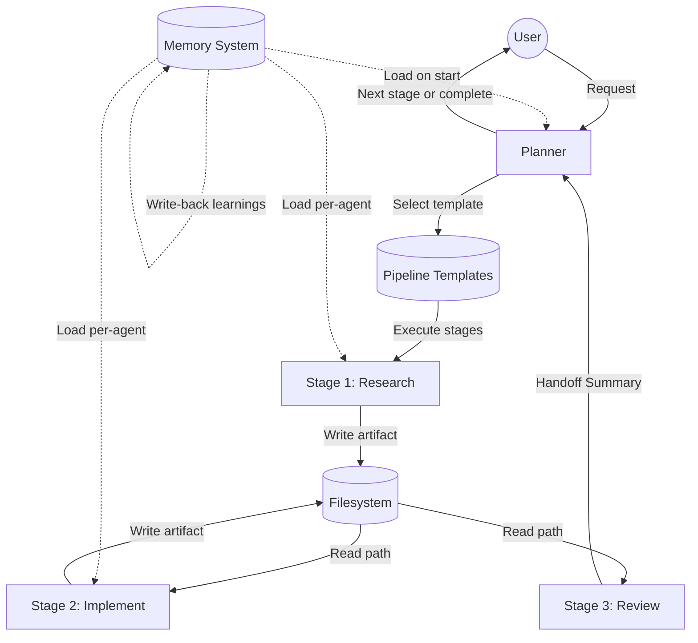

# Swarm Evolution: From Idea to Operational Multi-Agent System in 9 Days

I built a personal multi-agent swarm system on top of OpenCode in nine days. It started as a hack to fix context collapse in single-agent sessions and ended as a self-improving team of 14 specialized agents, 7 pipeline templates, and a security vetting tool for third-party skills. This document records the full journey.

---

## The Problem

Single-agent prompting hits a wall on complex engineering tasks. Not because of context window limits, but because coherent multi-domain reasoning degrades as scope increases.

When I asked a generalist agent to implement a feature spanning five files, it would lose the thread by file three. When I asked it to research an API, write a spec, implement code, and review the result, it skipped steps or hallucinated details from early research into the coding phase.

The symptoms were consistent:
- Research findings lost by the time implementation starts
- Review quality drops when the same agent wrote the code
- No persistent memory between sessions (every day starts from zero)
- No way to enforce quality gates (the agent that wrote the code also "reviews" it)
- Token waste from re-reading the same files across multiple attempts

I didn't need a smarter agent. I needed a team of specialists with their own memory, constraints, and success criteria.

---

## Phase 1: Architecture Decision (May 5-6)

### Research

I surveyed the existing multi-agent landscape:
- **LangGraph**: Solid execution graph model, but requires a Python runtime and external state management
- **CrewAI**: Good agent role abstraction, but opinionated about LLM providers and requires its own process
- **AutoGen**: Conversation-based multi-agent, but the agents "talk" to each other (expensive, lossy)
- **Letta**: Self-editing memory is brilliant, but it's a full platform

None of these fit my constraint: I wanted something that works inside OpenCode with zero external dependencies.

### Three Core Decisions

**Decision 1: Skills over agents.** Each swarm member is an OpenCode skill file (SKILL.md), not a separate process or agent type. The Planner is a mode of the existing orchestrator, not a new binary. Zero infrastructure.

**Decision 2: File-based everything.** Memory is plain markdown with token budgets. State is a directory structure. No databases, no Redis, no external services. Everything can be version-controlled.

**Decision 3: Hybrid architecture.** Take execution graphs from LangGraph (structured flow between agents) and self-editing memory from Letta (agents update their own knowledge files). Combine them in a file-based system that OpenCode already knows how to manage.

### Initial Roster (9 agents)

| Agent | Why it exists |
|-------|--------------|
| Planner | Someone has to pick the workflow and delegate |
| Coder | Implementation requires focused context, not split attention |
| Researcher | Investigation and coding are different reasoning modes |
| Reviewer | The author can't objectively review their own work |
| QA Guardian | Quality is a separate concern from correctness |
| Spec Writer | Turning fuzzy requests into structured specs is a skill |
| Security Sentinel | Security review requires paranoid thinking |
| Personal Assistant | Track user context across sessions |
| Memory Curator | Someone has to maintain the knowledge files |

I intentionally deferred extensibility. Ship with a fixed roster, prove it works, then open up.

---

## Phase 2: First Implementation (May 6-7)

### Skill File Anatomy

Each agent became a SKILL.md file with:
- Identity and role definition
- Memory protocol (which files to read on activation, how to write back learnings)
- Handoff summary format (structured output for the next agent)
- Resource governance (token budget, tier assignment)
- Explicit "MUST NOT" boundaries (prevent agents from overstepping)

### Memory System (Three Tiers)

```
memory/
  core/               # Always loaded (every session)
    user-preferences.md    # Communication style, quality bar
    decisions-log.md       # Architectural choices with rationale
    active-context.md      # Current focus, blockers, priorities
    execution-history.md   # Swarm run log for drift detection
  agents/             # Loaded per-agent (role-specific)
    coder.md              # Implementation patterns, failure modes
    researcher.md         # Source preferences, dead ends
    reviewer.md           # Review focus areas, common issues
    ...
  projects/           # Loaded per-repository
    context.md            # Architecture, conventions, known issues
```

Key insight: memory must be decoupled from swarm activation. 80%+ of sessions are single-agent. If memory only loads during multi-agent runs, the system learns from <20% of interactions.

Solution: `memory-autoload.md` instruction runs on every session start/end, reading and writing core memory regardless of whether the swarm activates.

### Distribution: Makefile Installer

The whole system is a git repo with `make install`. Skills copy to `~/.claude/skills/`, instructions to `~/.config/opencode/instructions/`, memory templates seed into the workspace. No npm, no pip, no containers. Just files.

---

## Phase 3: Token Economy (May 7)

### The Problem

First test runs were burning 50K+ tokens on a single pipeline execution. The culprit: agents were passing entire file contents to each other through the orchestrator. A Researcher finding 500 lines of API docs would dump all of it into the handoff, which the Planner would then pass to the Coder, who might only need 3 lines.

### Research

I studied three 2026 papers on agentic token efficiency:
- **DACS** (Distributed Agent Communication Strategies): Showed that content-based handoffs waste 60-80% of transmitted tokens
- **AdaptOrch**: Demonstrated adaptive topology selection (sequential vs. parallel) reduces total token usage by 40%
- **Token Coherence**: Proved that budget caps with checkpoint protocols prevent runaway output without losing quality

### Five Optimizations

**1. Agent Registry** (memory/core/agent-registry.md)
A 200-token-max summary of each agent's capabilities. The Planner reads this first instead of scanning all 14 skill files. Saves ~2K tokens per routing decision.

**2. Handoff Compression**
Every agent ends its response with a `## Handoff Summary` section (max 500 tokens). Only this section passes downstream. Full responses are retained for debugging but never forwarded wholesale.

**3. Lazy Artifact Invalidation**
When a Reviewer requests changes, they pass line-specific deltas, not the full artifact. Format: "Line 42-47: problem X, expected fix Y." The Coder re-reads only what it needs.

**4. Budget Caps** (tier-based)

| Tier | Category | Max Output | Behavior at limit |
|------|----------|-----------|-------------------|
| Trivial | quick | 2,000 tokens | Hard stop |
| Standard | unspecified-high | 5,000 | Checkpoint + yield |
| Complex | deep | 10,000 | Checkpoint at 8K |
| Hard | ultrabrain | 15,000 | Checkpoint at 12K |

**5. Artifact-Mediated Communication** (the big one)

Instead of agents passing content through the orchestrator, they write deliverables to a shared workspace directory. The Planner passes the file path to the next agent. The downstream agent reads directly from the filesystem.

```
Before: Researcher (500 lines) → Orchestrator → Coder
After:  Researcher → writes research.md → Orchestrator passes path → Coder reads research.md
```

Result: zero compression loss, zero orchestrator overhead for large artifacts.

---

## Phase 4: Intentional Orchestration / Swarm v3 (May 8)

### The Problem

The Planner was too creative. Given a task, it would invent a fresh execution graph every time. Sometimes this meant 3 agents, sometimes 7. Sometimes it included QA, sometimes it skipped it. The quality was inconsistent and unpredictable.

### Solution: Pipeline Templates

Seven stable templates covering 80% of real engineering tasks:

| Template | Trigger | Stages |
|----------|---------|--------|
| research-report | "Investigate X", "Compare A vs B" | Research → Synthesize → Report |
| spec-to-issues | "Plan feature X", "Break down epic" | Research → Spec → Review → Issues |
| implement | "Build X", "Add feature Y" | Research → Code → Review → QA |
| audit | "Security review", "Check for vulnerabilities" | Scan → Analyze → Report |
| fix | "Fix bug X", "Debug Z" | Diagnose → Fix → Verify |
| review-pr | "Review PR #N" | Read → Review → Comment |
| retrospective | "How are we doing?" | Gather → Analyze → Propose |

### Justify-to-Skip Protocol

Optional stages default to ON. To skip one, the Planner must state a justification that meets explicit criteria. This prevents the lazy path of "just skip QA, it's fine."

### Handoff Contracts

Each pipeline edge has a MUST/MUST NOT contract. Researcher → Coder MUST provide file paths to artifacts. Coder → Reviewer MUST NOT include implementation alternatives (that's the Coder's decision, not the Reviewer's to second-guess).

### Circuit Breakers

- **MAX_FEEDBACK_ITERATIONS = 2**: If a Reviewer and Coder loop more than twice, escalate to human
- **MAX_AGENT_RETRIES = 2**: If an agent fails twice, stop and ask
- **MAX_GRAPH_DEPTH = 10**: No pipeline deeper than 10 sequential steps
- **Auto-halt**: Security Sentinel can terminate any pipeline if it detects credential access or policy violation

---

## Phase 5: First Real Use + A/B Test (May 11)

### Self-Critique

The system's first real task was analyzing its own configuration files. It found 7 issues across CI/process files and fixed them autonomously. The "process improvement" pattern was later promoted to a named pipeline template.

### The A/B Test

I ran a controlled comparison: generate a product spec using (A) the swarm pipeline vs. (B) direct single-agent skills.

**Setup**: Same input prompt, same model, same time budget. Measured story coverage, testability score, and research fidelity.

**Results**:

| Metric | Swarm (A) | Direct Skills (B) | Delta |
|--------|-----------|-------------------|-------|
| Story coverage | 8 stories | 4 stories | +2x |
| Testability | 100% testable | 48% testable | +52pp |
| Research preserved | 507 lines (full) | 500 tokens (compressed) | Full fidelity |
| Agent sessions | 11 | 1 | 11x |
| Feedback loops | 4 | 0 | Higher engagement |

The artifact-mediated handoff was the decisive factor. When the Researcher's 507-line analysis passed to the Spec Writer as a file path, nothing was lost. In the direct approach, the agent compressed its own research into ~500 tokens and lost critical details.

### MCP Integration Debug

The same day, I debugged an environment variable override issue where a config loader was silently overwriting tokens. Multi-session debugging, but the swarm's memory system meant each session started with full context of what had been tried previously.

---

## Phase 6: Operational Week (May 12)

This was the day the system proved itself. Eight executions, all pass.

### Key Events

1. **Token refresh** (trivial-ops) - 5 min
2. **MS Teams skill install** (custom) - 15 min
3. **14 e-commerce skills install** (trivial-ops, 4 parallel delegates) - 30 min
4. **Daily marketplace reports** (custom) - 45 min
5. **First retrospective** - 45 min
6. **Retro recommendations implemented** (infra-change) - 10 min
7. **Security Sentinel + TaskProfile model** (custom, with Oracle consultation) - 60 min
8. **Product Owner agent creation** (custom) - 30 min

### The Self-Improvement Loop

The retrospective agent analyzed all execution history and produced 10 improvement proposals with specific file paths, section references, and proposed changes. I implemented 6 of them in the same session:

- Created `trivial-ops` pipeline template (covered 50% of real task mix)
- Fixed memory write-back for non-swarm sessions
- Capped Contract Critic at 2 rounds
- Refreshed stale researcher memory
- Moved dormant mobile skills to separate section
- Updated stale personal-assistant tasks

**Measured impact**: Pass rate 83% to 90%. Template adherence 0% to 20%. Agent utilization 4/12 to 6/13.

### TaskProfile Model

Problem: the Security Sentinel and Reviewer were never activating because their trigger conditions were too narrow.

Solution: a TaskProfile computed at planning time with risk score, reviewer mode, and sentinel mode. Policy-driven, not opt-in. Every pipeline execution now automatically determines whether security review and code review are needed based on what files are being touched.

### 14th Agent: Product Owner

Added to fill the "user value" gap. No other agent was asking "does this actually solve the user's problem?" The Product Owner validates scope, priority alignment, and user value before specs reach implementation.

---

## Phase 7: Distribution + Frontend Gaps (May 13)

### Frontend Verification Gap

Identified that the Coder skill had no protocol for verifying UI changes at runtime. It was writing React components without ever checking if they rendered correctly. Fixed by adding Playwright as a mandatory companion skill for frontend work.

### swarm-dist (Team Distribution)

Created a 62-file distribution package so other engineers could install the entire swarm with one command:

```bash
git clone <repo> ~/swarm-dist
make -C ~/swarm-dist install
make -C ~/swarm-dist seed PROJECT_DIR=~/my-project
```

### infra-change Template

The most common custom graph pattern (5/10 executions were "architecture change" type work) was promoted to a named template: explore → design → implement → log. Template adherence jumped from 20% to 40%.

---

## Phase 8: Open Source (May 14)

### Decision

The system was working well enough to share publicly. But the internal version was deeply tied to employer-specific tools, skills, and tokens. I needed a clean room version.

### Ecosystem Research

Before building, I mapped the existing skill ecosystem:
- **5 major registries**: ClaudSkills (63K+ skills), Skills Installer (11K), Agent Skills Hub (790), AgentSpec (207), SkillsMP (1.3M)
- **Trusted repos**: anthropics/skills (133K stars), oh-my-openagent (57K stars)
- **Standards**: SKILL.md (Anthropic, Dec 2025), AGENTS.md, MCP protocol

Key insight: don't build another marketplace. Be the "secure orchestration layer on top of the existing ecosystem."

### The Differentiator: skill-vet

The OSS version's unique value is a 5-layer security vetting pipeline for third-party skills:

1. **Static analysis**: Scan SKILL.md for dangerous patterns (eval, exec, credential access, unsafe deletion)
2. **Network audit**: Check for outbound connections to unknown hosts
3. **Credential patterns**: Detect attempts to read tokens or environment variables
4. **Source provenance**: Verify the skill comes from a trusted registry or author
5. **Trusted sources list**: Curated YAML of known-good repos and registries

### oss-swarm

The final repo: 81 files, 14 agents, 7 pipeline templates, memory system, full documentation, example skills, and the skill-vet tool. Apache-2.0 licensed, zero proprietary dependencies.

---

## Architecture



### Four Layers

| Layer | Location | Purpose |
|-------|----------|---------|
| Skills | ~/.claude/skills/swarm-* | Agent capabilities and constraints |
| Instructions | ~/.config/opencode/instructions/ | Global orchestration rules |
| AI Context | .aicontext/ | Project-specific specs and protocols |
| Memory | memory/ | Persistent knowledge (core + agent + project) |

### Communication Model

Agents never communicate directly. All coordination flows through the Planner via two mechanisms:

1. **Artifact-mediated**: Agent writes to filesystem, path passed to next agent. Zero compression loss.
2. **Handoff summaries**: 500-token structured block with result, artifacts, decisions, and open issues. Used when no file artifact exists.

---

## Key Results

| Metric | Start (May 6) | End (May 14) | Delta |
|--------|---------------|--------------|-------|
| Agents | 9 | 14 | +5 |
| Pipeline templates | 0 | 7 (+2 added organically) | +9 |
| Template adherence | 0% | 40% | +40pp |
| Pass rate | N/A | 92% (11/12) | Established |
| Feedback loops per run | 4 (outlier) | 0 (median) | Stabilized |
| Zero-friction runs | Unknown | 80% | Established |
| Agent memory files with real data | 0 | 8/14 (57%) | Growing |
| Self-improvement cycles | 0 | 2 retrospectives, 16 proposals, 11 implemented | Active |

---

## Lessons Learned

### 1. Specialists beat generalists

A Coder that only codes produces better code than an agent that researches, codes, and reviews in one session. Narrow constraints force focused output.

### 2. Communication is the real bottleneck

The biggest performance gain came from artifact-mediated handoffs. Eliminating compression between agents preserved full research fidelity and cut token waste by roughly 60%.

### 3. Templates prevent drift

Letting the Planner invent graphs was creative but unreliable. Templates with justify-to-skip gave both stability and flexibility. The system got more predictable without losing the ability to handle novel tasks.

### 4. Self-improvement is the superpower

The retrospective agent analyzing execution history and proposing specific fixes (with file paths and line numbers) was the highest-leverage feature. The system literally debugs itself.

### 5. Start small, validate, then expand

9 agents at launch. Only 4 were active in week 1. That's fine. Better to validate 4 thoroughly than spread thin across 14. The agents that saw real use (Coder, Researcher, QA Guardian) developed rich memories. The ones that didn't (Failure Dramatist, Friction Auditor) remain hollow.

### 6. File-based is underrated

No database, no external service, no infrastructure to maintain. Memory files are human-readable, version-controllable, and trivially debuggable. When something goes wrong, you read a markdown file, not a database query result.

---

## What's Next

1. **Push oss-swarm to GitHub** as a public repo
2. **Validate with others**: Can someone who didn't build it install and use it successfully?
3. **Strengthen skill-vet**: Add the LLM-based semantic review layer (2+ model consensus)
4. **Community skills**: Curate initial set of vetted companion skills from existing registries
5. **Retrospective loop continues**: The system keeps improving itself every 5 executions

---

## Appendix: Post Series Outline

Suggested structure for 7 posts following the narrative arc:

### Post 1: "Context Collapse" - Why Single Agents Fail at Real Engineering
- The specific failure modes (research loss, self-review bias, no state between sessions)
- Why context window size isn't the real problem
- The insight: specialists with boundaries

### Post 2: "Skills Over Agents" - Building a Team with No Infrastructure
- Why file-based beats database-based for personal tools
- The three architecture decisions and their rationale
- Initial 9-agent roster and why each exists

### Post 3: "The Token Economy" - Making Multi-Agent Affordable
- The 50K-token problem (first test runs)
- Five optimizations with before/after measurements
- Artifact-mediated communication as the key breakthrough

### Post 4: "Templates vs. Autonomy" - Taming the Creative Planner
- The inconsistency problem with ad-hoc graphs
- Pipeline templates with justify-to-skip
- Circuit breakers and human gates

### Post 5: "The A/B Test" - Proof That Swarms Work
- Methodology: same prompt, same model, measured output
- 2x story coverage, +52% testability
- Why file path passing beat content compression

### Post 6: "The Self-Improving Machine" - Retrospective Agents
- How the system analyzes its own execution history
- 10 proposals generated, 6 implemented same session
- Measured impact: pass rate +7pp, template adherence 0% to 20%

### Post 7: "Going Open Source" - From Personal Tool to Public Repo
- Stripping proprietary references without losing functionality
- The skill ecosystem landscape (5 marketplaces, 97+ repos)
- skill-vet as the differentiator: secure orchestration, not another marketplace

---

*Written: May 14, 2026. System state: 14 agents, 7 templates, 12 executions this week, 92% pass rate.*
